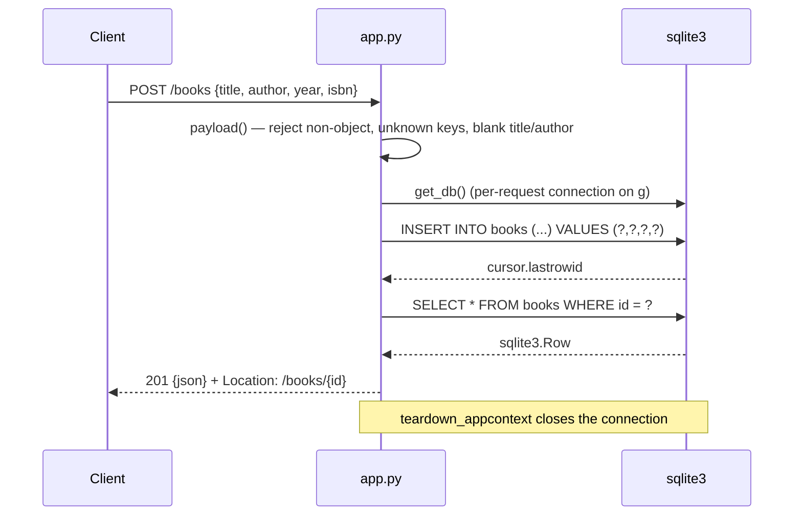

# Flow

A `POST /books` is validated entirely in `app.py:56 payload()` before any SQL
runs: the body must be a JSON object, unknown keys are rejected, `title` and
`author` must be non-blank strings, `year` must be an `int` (bools excluded via
`type(year) is not int`) inside SQLite's signed 64-bit range, and `isbn` must be
a non-blank string. String fields are trimmed. The insert runs inside a `with db`
transaction, the row is read back through `app.py:76 book_by_id()`, and the
response carries a relative `Location` built by `url_for`.

Deviations from the common pattern worth noting: there is no ORM and no
migration tool — the schema is created with `CREATE TABLE IF NOT EXISTS` at app
construction (`app.py:38-47`). Connections are per-request and stored on `g`,
closed by `teardown_appcontext`, so no connection pool exists. `PUT` is a full
replace, not a merge: omitted optional fields are set to `NULL`. The `?author=`
filter is an exact, case-sensitive SQL equality match, parameterized (no string
interpolation anywhere). All errors, including framework-generated ones, are
funnelled through a single `HTTPException` handler so no HTML error page can
escape.
