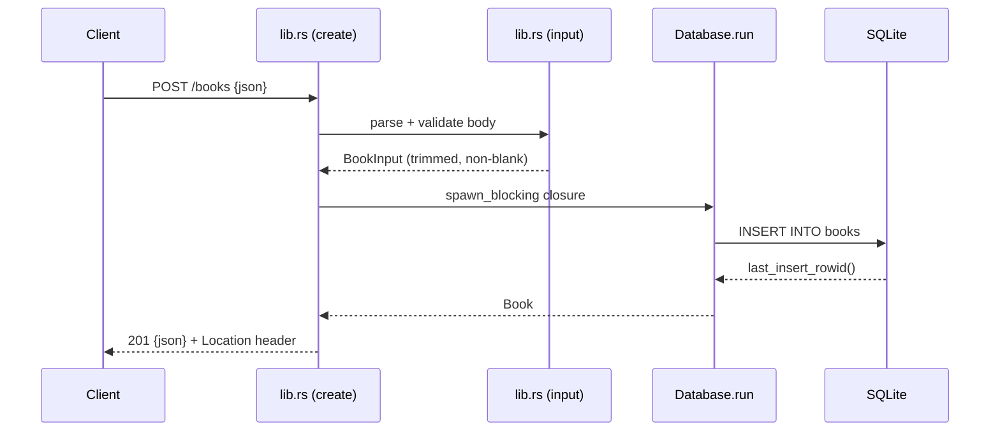

# Flow

A `POST /books` request is deserialized into `BookInput`; `input()` maps any `JsonRejection` to a `400` (or `415`/`413` for media/size), then `validate()` trims and rejects blank `title`/`author`. The validated fields are moved into a closure passed to `Database::run`, which serializes DB access through an `Arc<Mutex<Connection>>` on Tokio's blocking thread pool, executes the parameterized `INSERT`, and returns the new `Book` with its generated id. The handler responds `201` with a `Location` header and the JSON body. All queries are parameterized (the `?author=` filter and id lookups included), so no SQL injection surface; DB errors are logged and surfaced as an opaque `500`.
