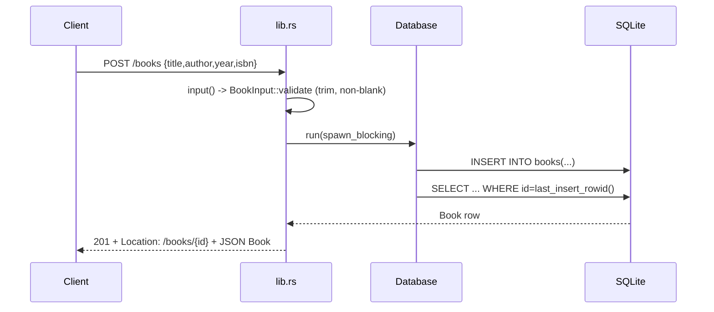

# Flow

A `POST /books` is deserialized into `BookInput`; `validate()` trims `title`/`author` and rejects blanks with `400`. The work is handed to `Database::run`, which acquires the shared `Mutex<Connection>` inside `tokio::task::spawn_blocking` so blocking SQLite calls never stall the async runtime. The row is inserted and re-read via `find()`, then returned as `201` with a `Location` header. Errors map through `ApiError` into JSON: malformed body → `400`, missing fields/wrong types → `422` (Axum JSON rejection), wrong content type → `415`, DB failures → `500`. Access is serialized through one connection with a 5-second busy timeout — correct but single-writer.
