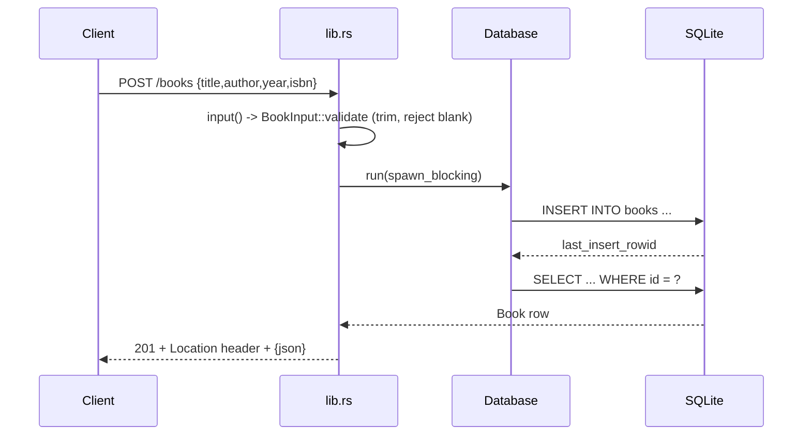

# Flow

A `POST /books` request is deserialized into `BookInput`; `validate()` trims and rejects blank title/author with 400. The handler hands a closure to `Database::run`, which offloads to `tokio::task::spawn_blocking` and locks the single shared `Connection` before executing the `INSERT`, then re-selects the inserted row to build the response. Success returns 201 with a `Location: /books/{id}` header and the JSON body. All DB access is serialized through one `Arc<Mutex<Connection>>`, so handlers are async but the database is effectively single-threaded; errors map through a single `ApiError` type that hides SQLite details behind a 500.
