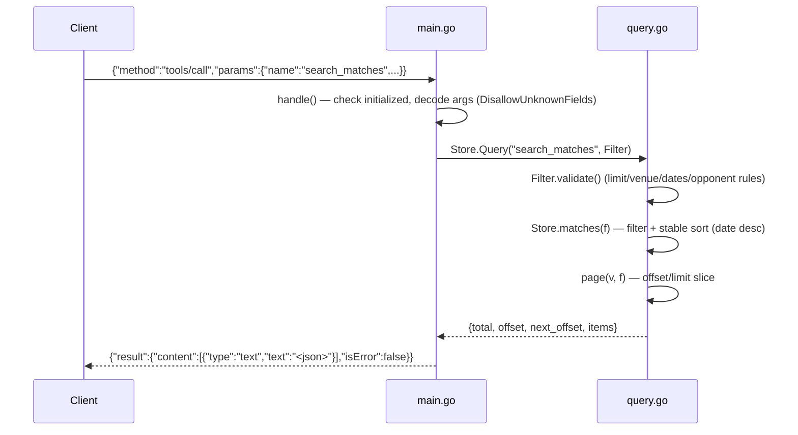

# Flow

At startup `main()` calls `Load("data/kaggle")`, which reads all six CSVs, normalizes team names and dates, and deduplicates directed Serie A/B fixtures per season while merging enrichment (extra sources, corner/shot attributes, stadium) from overlapping datasets. Each incoming JSON-RPC line is dispatched by `Server.handle`. A `tools/call` is rejected until the client has sent `notifications/initialized`; arguments are decoded with `DisallowUnknownFields` so unknown keys become `-32602` errors. `Store.Query` validates the filter, runs the in-memory filter/aggregate, and returns paginated JSON wrapped in an MCP `content` block. Notable: read-only design (every tool is annotated `readOnlyHint`), all responses carry a `caveat` note about data limitations, standings are restricted to Serie A/B with an explicit error steering cup queries to `competition_info`, and cup "final" labels are inferred from the maximum recorded round (surfaced as such).
