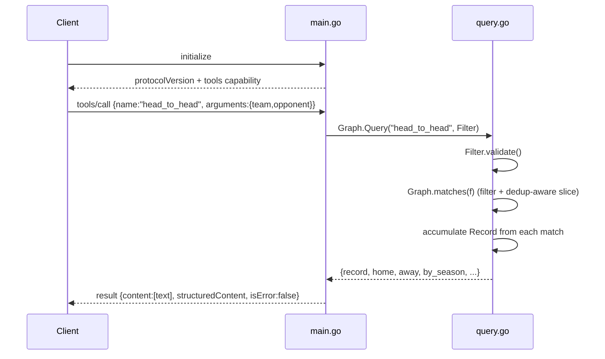

# Flow

At startup `main()` calls `Load("data/kaggle")`, which reads all six CSVs, normalizes team names (accent-folding + state-suffix stripping + alias table) and dates (multiple layouts), and **deduplicates matches across overlapping sources** (Serie A keyed by competition|season|home|away, merging provenance and reconciling conflicting scores with a warning). `Serve` then runs a JSON-RPC read loop over stdin. A `tools/call` validates the decoded `Filter` (rejecting unknown fields, bad venue/date/limit), filters `g.Matches`, aggregates into the tool-specific shape, and returns both a text rendering and `structuredContent`. Query errors surface as `isError:true` tool results rather than protocol errors. All handlers are read-only.
