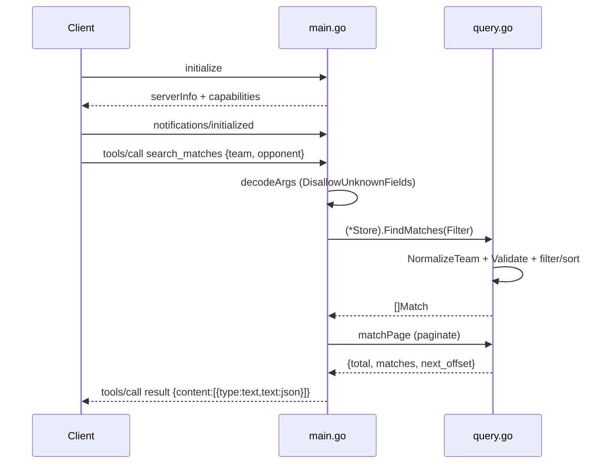

# Flow

At startup `main()` calls `LoadStore("data/kaggle")`, which reads all six CSVs, normalizes team names, merges cross-source duplicate fixtures within a one-day window (league fixtures also merge postponed dates), infers Copa do Brasil terminal stages, and builds team/club indexes. `Serve` then runs a JSON-RPC stdio loop that enforces the MCP handshake before any tool call. A `tools/call` decodes arguments with unknown-field rejection, dispatches to `(*Store).Call`, which routes to the matching query function; match-returning tools are paginated via `matchPage`, while aggregate tools (team_stats, standings, statistics) ignore pagination by design.

Notable: input is validated at the boundary (`Filter.Validate`, strict JSON decoding, protocol-version and handshake gating); errors from tools are returned as MCP `isError` tool results rather than JSON-RPC faults; no external network or third-party dependencies; all data is loaded once into memory.
