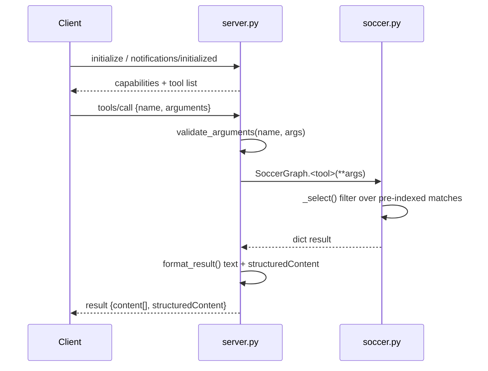

# Flow

On startup `SoccerGraph.__init__` reads all six CSVs once (UTF-8 with BOM handling), normalizes team names via `team_key`/`ALIASES`, deduplicates matches by (competition, date, home, away) — including a ±1-day cross-source merge for identical scores — and builds `by_team`/`by_id` indexes plus derived cup stages. Each `tools/call` validates arguments against the auto-generated JSON schema, dispatches to the matching `SoccerGraph` method (which filters the in-memory index via `_select`), then returns both a human-readable text summary and full `structuredContent`. Errors are surfaced as `isError: true` tool results (`ValueError`/`TypeError`) or JSON-RPC error codes for protocol violations; parse errors on a line do not stop the loop. No network, SQL, or shell access is exposed.
