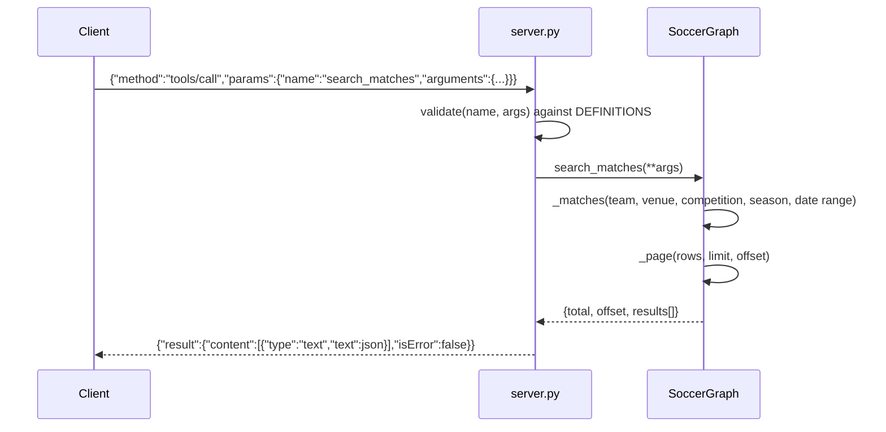

# Flow

A `tools/call` request is validated against the tool's JSON schema (required keys,
types, enums, integer ranges) in `server.py:validate`, then dispatched by name to the
matching `SoccerGraph` method. For `search_matches`, the central `_matches` helper
normalizes team/competition/date inputs (accent-folding, alias mapping, multi-format
date parsing) and filters the pre-built, deduplicated match list, then `_page` applies
limit/offset and returns `{total, offset, results}`. The result is JSON-serialized into
MCP text content. Validation or domain errors (`ValueError`/`TypeError`) are caught and
returned as `isError:true` content rather than JSON-RPC errors.

The match list is built once at `SoccerGraph.__init__`: all 6 CSVs are read
(utf-8-sig), per-row normalized, and cross-source duplicate fixtures are merged on
`(date, home, away, competition)` with ±1-day reconciliation when scores agree;
conflicting scores and unparseable rows are recorded in `issues` rather than dropped
silently. Notable: no external MCP SDK dependency (hand-rolled JSON-RPC); no network or
live data; `top_scorers`/`bracket` deliberately decline to infer data the datasets
don't contain.
