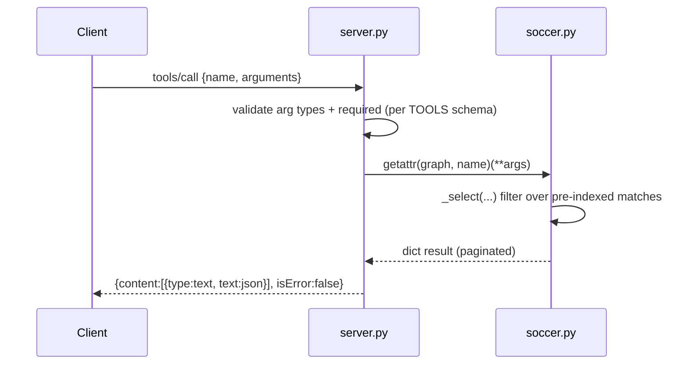

# Flow

A `tools/call` request is validated against the tool's `inputSchema` (each argument's Python type and required fields checked in `server.py`), then dispatched by name to the matching `SoccerGraph` method. Query methods run through `_select`, a generator that filters the pre-indexed match list (teams are indexed in `self.teams` at load time for team-scoped queries). The result dict is JSON-serialized (with `ensure_ascii=False`, `allow_nan=False`) into MCP text content. `ValueError`/`TypeError` from the graph are caught and returned as `isError:true` rather than crashing the server.

Notable: the server enforces the MCP handshake (`tools/call` before `notifications/initialized` returns `-32000`); all data is loaded once at startup from CSV into memory; there is no network access, no write path, and no persistence between calls. Match dedup across the five overlapping CSVs is done at load with a ±1-day, same-teams/same-score reconciliation heuristic to merge UTC/local-day duplicates.
