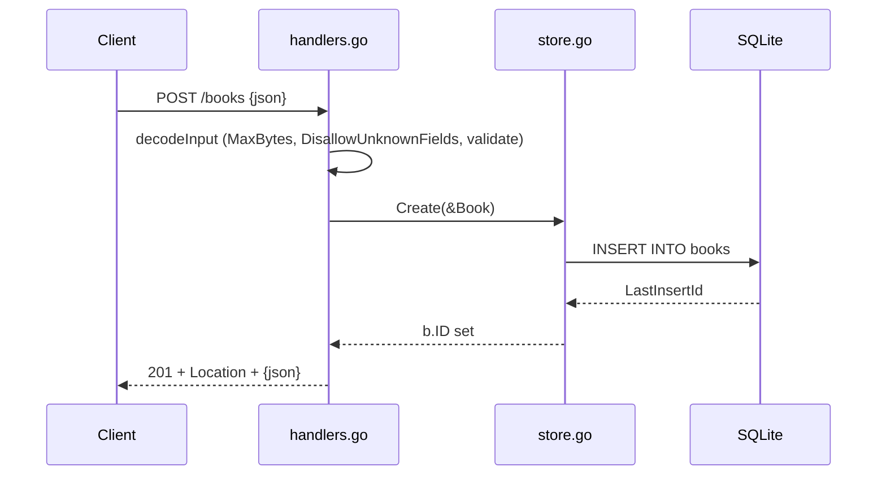

# Flow

A `POST /books` request is decoded with a 1 MiB cap and `DisallowUnknownFields`, then validated (title/author required, year and isbn range-checked). On success the handler inserts the row via `Store.Create`, which populates the generated `ID`, and responds `201 Created` with a `Location` header and the JSON book. Errors surface as structured `{error, fields}` JSON with `400` for bad input, `404` via `ErrNotFound` for missing ids, and `500` for unexpected store failures. Server startup is graceful (SIGINT/SIGTERM shutdown with timeout); health checks ping the DB.
