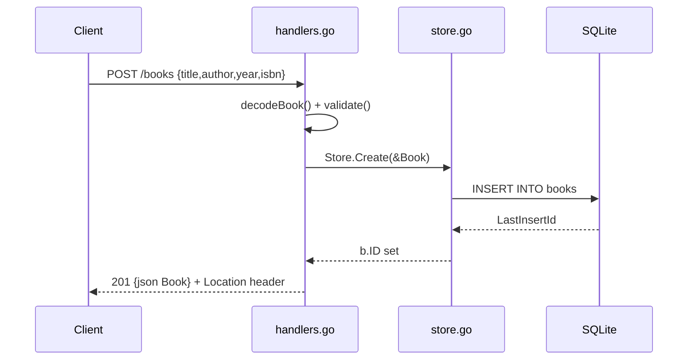

# Flow

A `POST /books` request is decoded with `DisallowUnknownFields` and a 1 MiB body cap, then validated (title/author required, year range, optional ISBN format). On success `Store.Create` inserts a row into the SQLite `books` table via the pure-Go `modernc.org/sqlite` driver and back-fills the generated id; the handler responds `201` with the JSON book and a `Location` header. Validation failures return `400` with a per-field error map; malformed JSON returns `400`. Persistence is real (SQLite file, `SetMaxOpenConns(1)`), not in-memory.
