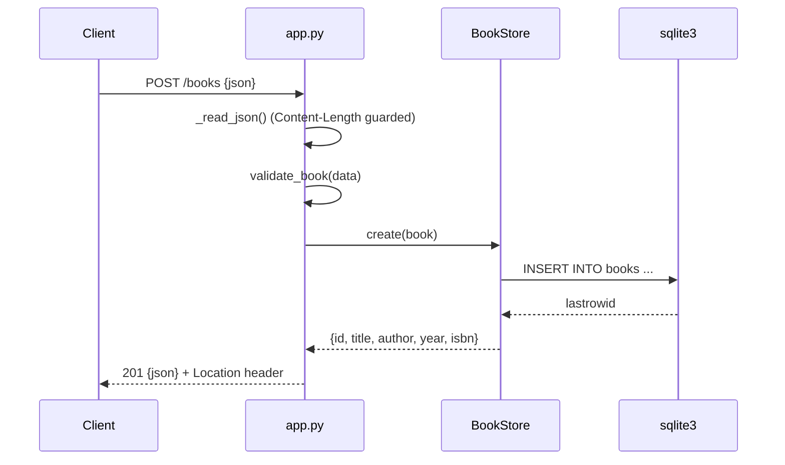

# Flow

A `POST /books` request is read with a `Content-Length` bound (max 1 MB) and JSON-decoded; `validate_book` enforces required non-empty `title`/`author`, an integer `year` in range, an ISBN-10/13-shaped `isbn`, and rejects unknown fields (422 with per-field `details` on failure). On success `BookStore.create` inserts under a `threading.Lock` and returns the persisted row, which is sent as 201 with a `Location: /books/{id}` header. The server is threaded (`ThreadingHTTPServer`) with a single shared SQLite connection (`check_same_thread=False`) serialized by the lock; persistence is real (file-backed SQLite by default).
