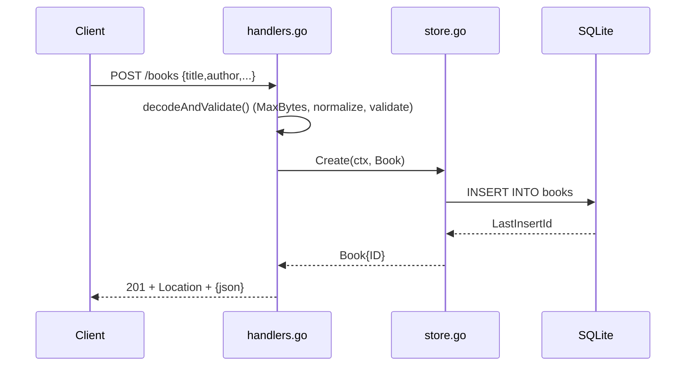

# Flow

A `POST /books` request is size-capped at 1 MiB, strictly JSON-decoded (rejecting
trailing data), trimmed, then validated (title/author required, optional year range
and ISBN shape). On success `SQLiteStore.Create` inserts a row and returns the book
with its generated ID; the handler sets a `Location` header and returns `201`.
Validation failures short-circuit to a `400` with a per-field error map before any DB
access. All handlers thread `r.Context()` to the store, and a single-writer connection
(`SetMaxOpenConns(1)`) serialises writes to avoid `SQLITE_BUSY`.
