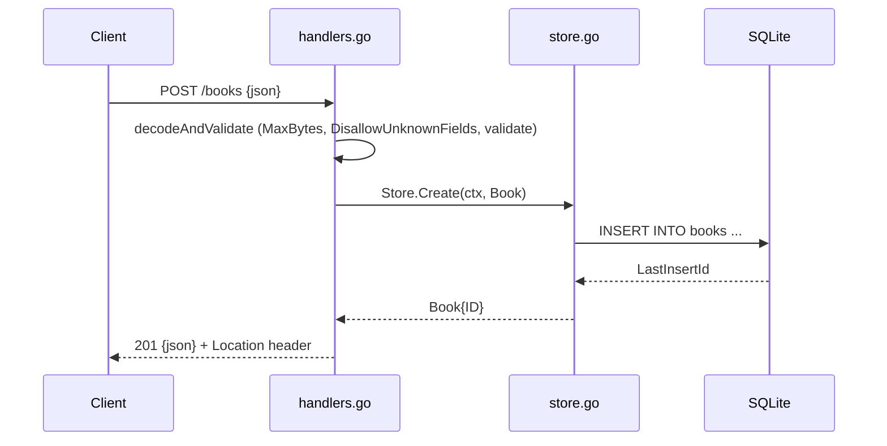

# Flow

A `POST /books` request is size-capped (1 MiB) and strictly decoded — unknown fields, trailing data, malformed JSON and wrong types all yield 400. `validate()` trims and enforces required `title`/`author`, length caps, a year range, and ISBN-10/13 shape. On success `Store.Create` inserts via a parameterized query on a single-connection SQLite handle and returns the row with its assigned ID, which the handler emits as JSON with a `Location` header. Errors are mapped centrally: `ErrNotFound`→404, DB failures→500 (logged, not leaked). No auth, pagination, or rate limiting — none were in scope.
