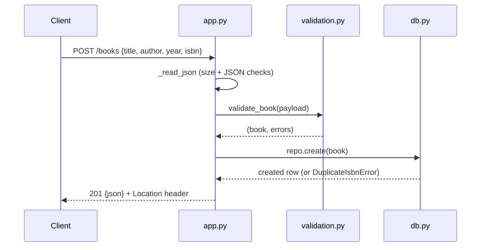

# Flow

A `POST /books` request is read via `_read_json` (rejects oversize bodies, empty/invalid JSON with 400), validated by `validation.py:validate_book` (title/author required, ISBN normalised and format-checked, unknown fields rejected), then persisted by `db.py:BookRepository.create` under a lock. A unique-ISBN collision surfaces as `DuplicateIsbnError` → 409; success returns 201 with a `Location` header. Notable: pure standard-library stack (wsgiref + sqlite3, no framework); a single shared SQLite connection guarded by a `threading.Lock` for thread safety; input validation and error handling are comprehensive rather than minimal.
