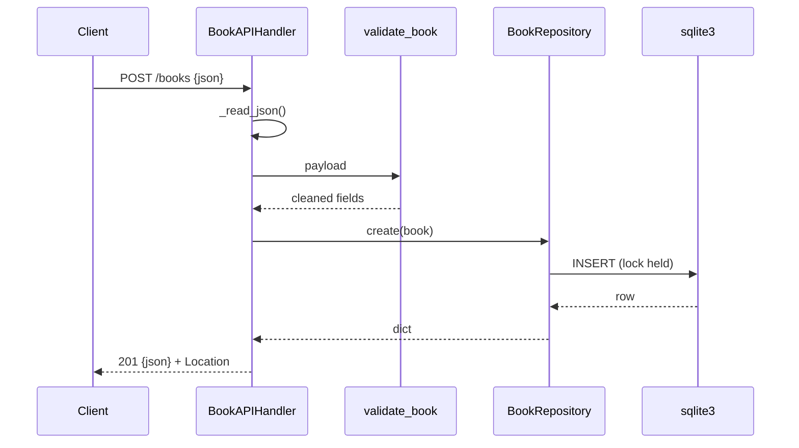

# Flow

A `POST /books` reads and JSON-decodes the body (rejecting empty, oversized, or
malformed bodies with `400`/`413`), validates required `title`/`author` plus
optional `year`/`isbn` (ISBN normalized and format-checked), then inserts under a
per-repository `threading.Lock`. A `UNIQUE` constraint violation on `isbn` is
mapped to `409`; success returns `201` with the created book and a `Location`
header. The repository serializes all DB access behind one lock, so the
`ThreadingHTTPServer` is safe for concurrent requests.
