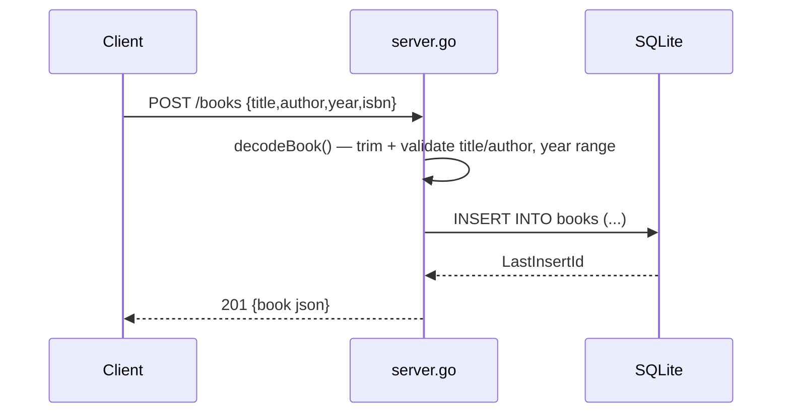

# Flow

A create request is decoded with `DisallowUnknownFields` and a 1 MiB body cap, then validated (`title`/`author` required after trimming, `year` bounded 0–9999). Valid rows are inserted via a parameterized query and returned as JSON with the generated id. All routes are registered with Go 1.22+ method-and-pattern `ServeMux` (`GET /books/{id}` etc.); ids come from `r.PathValue("id")`. Notable: health check pings the DB; author filter uses `COLLATE NOCASE` exact match; PUT is a full replace with the same validation as POST.
