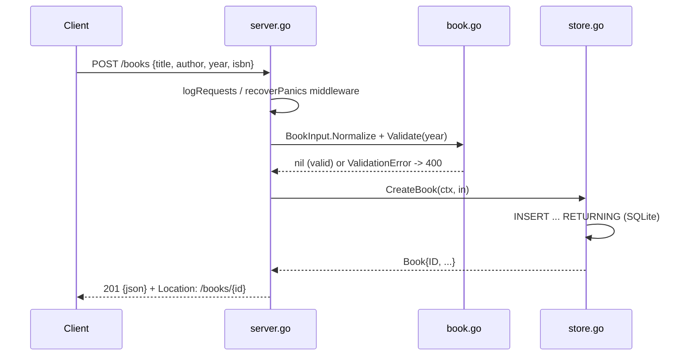

# Flow

A create request passes through the `logRequests` and `recoverPanics` middleware, is decoded with a body-size cap and strict single-JSON-value check, then normalized (whitespace trimmed, blank ISBN dropped) and validated (title/author required, bounded lengths, year in `[1, currentYear+1]`). On success the store inserts the row via `INSERT ... RETURNING` against a STRICT SQLite table and the server returns `201` with a `Location` header. Errors are funneled through `respondError`, which maps `ValidationError` to `400` with per-field messages, `ErrNotFound` to `404`, and anything else to a logged bare `500` (no internal detail leaked). Notable: full-replacement PUT semantics (omitted optional fields are cleared), WAL + busy_timeout pragmas, graceful shutdown, and a pure-Go SQLite driver (no CGO).
