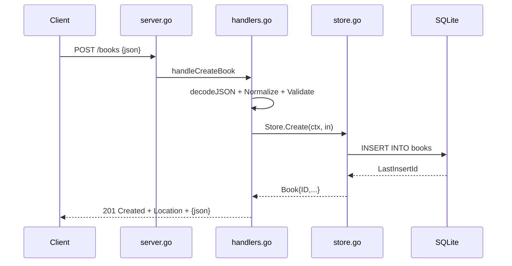

# Flow

A `POST /books` request passes through `logRequests` and `recoverPanics` middleware, then `handleCreateBook` decodes the body (capped at 1 MiB, rejecting trailing content and unknown-type fields), trims whitespace via `Normalize()`, and runs `Validate()` (title and author required; year and ISBN bounded). On success `Store.Create` inserts a row and returns the book with its assigned id; the handler sets a `Location` header and replies 201 with the JSON book. Validation failures short-circuit to a 400 with per-field messages; not-found and request errors map to 404/400 and any unexpected error is logged and returned as a generic 500. Persistence is real SQLite through a single-connection pool with WAL and busy_timeout pragmas.
