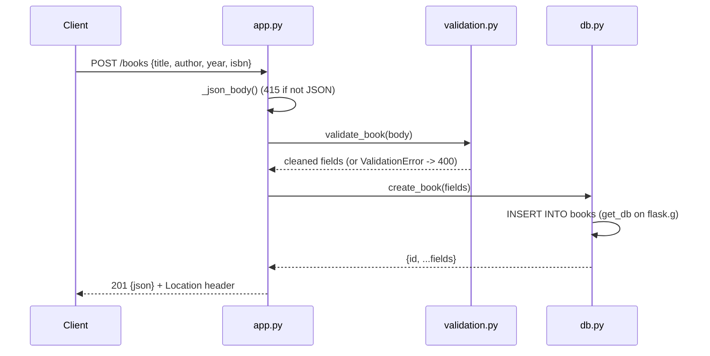

# Flow

A `POST /books` request first decodes the JSON body (415 if the `Content-Type` is not JSON, 400 if malformed). The payload is validated by `validation.py:validate_book`, which trims strings, requires `title` and `author`, range-checks `year`, verifies the `isbn` check digit, and rejects unknown fields — reporting every offending field at once (400). Valid fields are inserted by `db.py:create_book` through a per-request connection kept on `flask.g`, and the created book is returned as JSON with `201` and a `Location` header. Persistence is real SQLite with `AUTOINCREMENT` (deleted ids are not reused). Error handling is centralized: `ValidationError`, generic `HTTPException` (404/405/413/415/500), and DB failures on `/health` (503) are all rendered as JSON.
