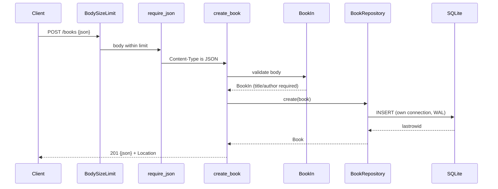

# Flow

A `POST /books` first passes the `BodySizeLimit` ASGI middleware (413 if too
large), then the `require_json` dependency (415 if the body is not JSON). The
body is validated by the `BookIn` Pydantic model — title and author are
required, trimmed, and rejected if blank or containing control characters;
failures become a 400 problem-details response. On success `BookRepository.create`
opens its own short-lived SQLite connection (WAL journaling, one connection per
operation so no cross-thread sharing) and INSERTs the row, returning the stored
book with its new id as 201 plus a `Location` header. Persistence is real
SQLite, not in-memory state.
