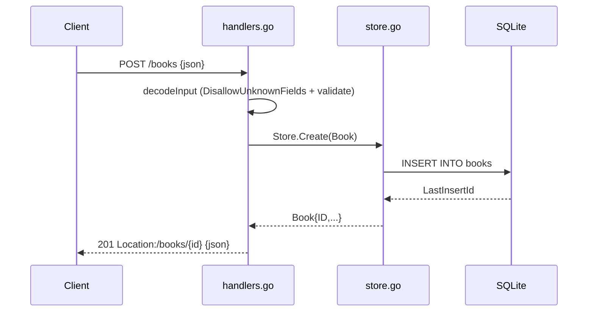

# Flow

A `POST /books` decodes the body with `DisallowUnknownFields` and a 1 MiB cap,
trims and validates (title/author required, year range, optional ISBN 10/13),
then `Store.Create` inserts the row and returns the book with its generated `id`.
The response is `201 Created` with a `Location` header and the JSON body.
Validation failures short-circuit to `400` with a per-field `fields` map; the
same decode+validate path guards `PUT`. Persistence is real SQLite (pure-Go
`modernc.org/sqlite`, `MaxOpenConns=1`), not in-memory state.
