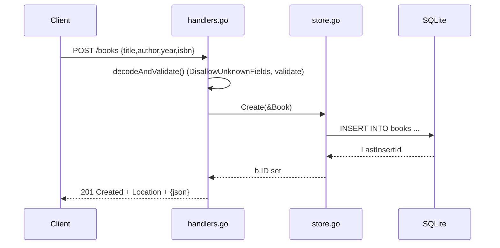

# Flow

A `POST /books` request is size-limited (1 MiB) and decoded with `DisallowUnknownFields`; the body must be exactly one JSON object. `bookInput.validate()` trims and checks that `title` and `author` are present (and bounds `year`/`isbn`), returning 422 with per-field messages on failure. On success `store.Create` inserts the row and populates the generated ID, and the handler responds 201 with a `Location` header and the created book as JSON. Not-found on id-addressed routes maps `ErrNotFound` to 404; malformed ids map to 400. Errors are returned as structured JSON throughout.
