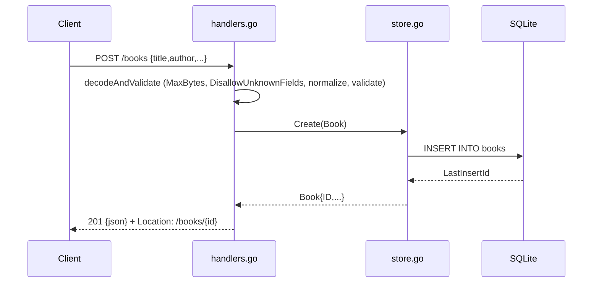

# Flow

A `POST /books` request is decoded through a size-capped, unknown-field-rejecting JSON decoder, trimmed (`normalize`) and validated (`validate` — title/author required, year range, optional ISBN format). Validation failures return `422` with a per-field error map; malformed/oversized/extra-field bodies return `400`. On success the book is inserted into SQLite via `Store.Create`, and the assigned id is returned as `201 Created` with a `Location` header. Notable: validation uses `422 Unprocessable Entity` rather than `400` for field errors; the mux's default 404/405 responses are rewritten to JSON by `jsonFallback`; `SetMaxOpenConns(1)` serializes writes.
