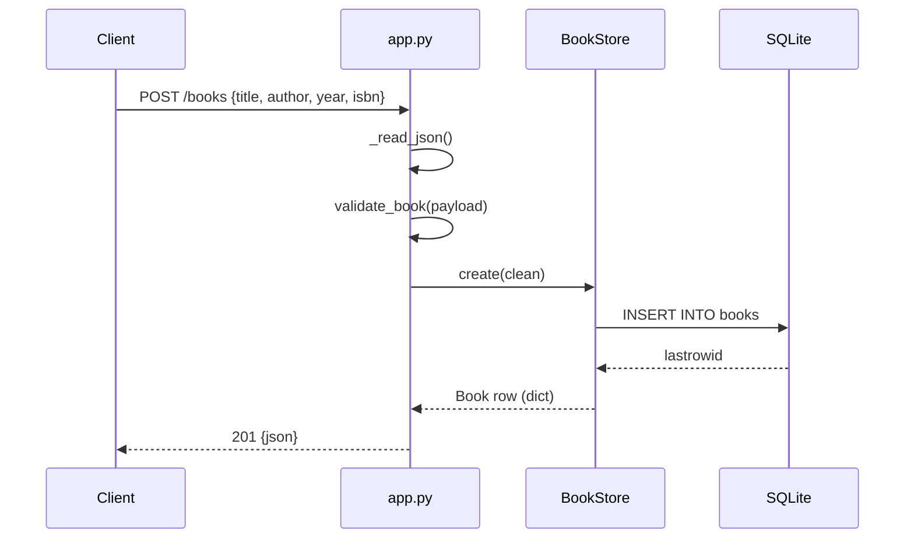

# Flow

A `POST /books` reads the request body, parses JSON (`_read_json`), and runs `validate_book`, which requires non-empty string `title` and `author` and type-checks optional `year` (int in range) and `isbn` (ISBN-10/13). On failure it returns `400 {"error":"validation failed","details":{...}}`. On success `BookStore.create` inserts under a lock and returns the persisted row as JSON with `201`. Notable: the whole service uses only the Python standard library (`http.server` + `sqlite3`) with no third-party framework; PUT is a full replacement (title+author required), and the single SQLite connection is shared across threads with `check_same_thread=False` behind one lock.
