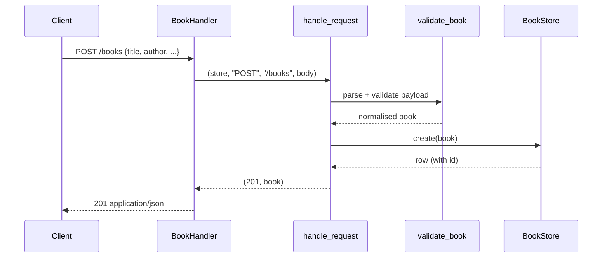

# Flow

A `POST /books` is read by `BookHandler._dispatch` (which enforces a 1 MiB body cap), then dispatched through the framework-independent `handle_request`. The body is JSON-parsed and passed to `validate_book`, which requires non-empty `title`/`author`, range-checks `year`, validates/normalises `isbn`, and rejects unknown fields. The validated dict is inserted by `BookStore.create` under a lock; a duplicate ISBN raises `ConflictError` → 409. Notable: routing is deliberately separated from the HTTP layer so it is unit-testable without a live socket; all DB access is serialized through a single `threading.Lock`.
