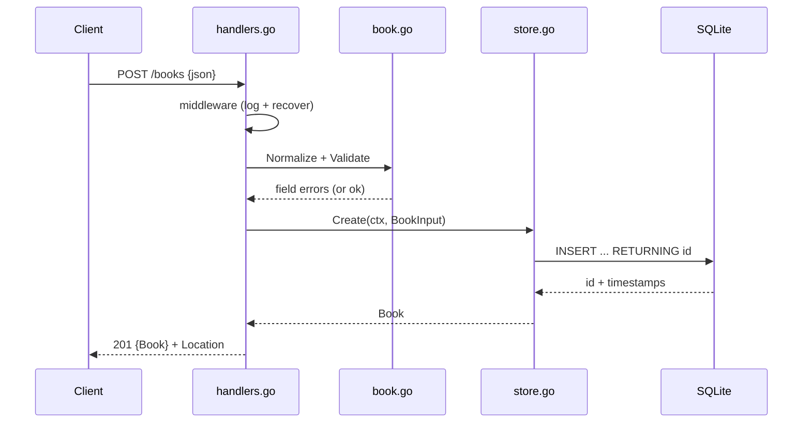

# Flow

A `POST /books` request passes through logging/panic-recovery middleware, is decoded with a 1 MiB body cap and strict single-object enforcement, then normalized and validated (title/author required, length caps, optional ISBN-format check). On success `store.Create` inserts the row and returns the assigned ID and timestamps, and the handler responds `201` with a `Location` header. Validation failures short-circuit to a structured `400` with per-field messages; store errors map `ErrNotFound`→`404` and everything else to a generic `500` (real cause logged, not leaked). Notable: full-replacement PUT semantics, WAL + busy_timeout pragmas, RFC3339 timestamps stored as text.
