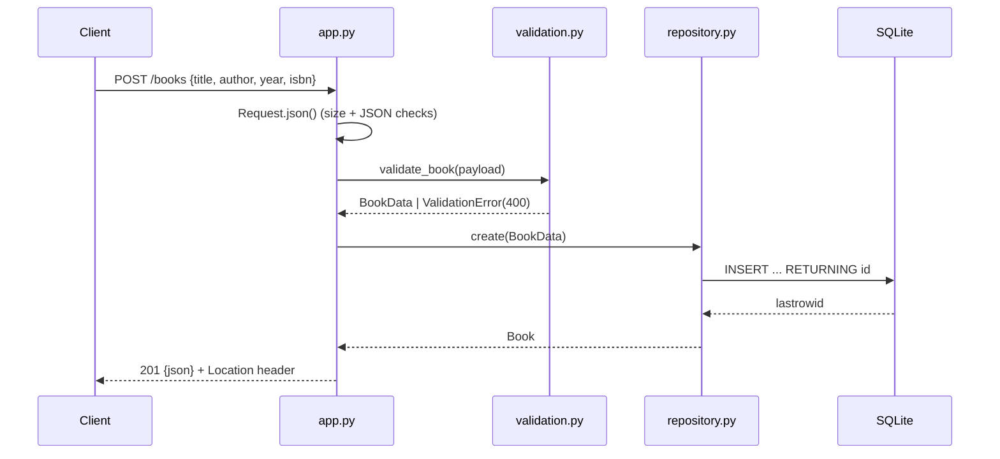

# Flow

A `POST /books` request is parsed by `Request.json()`, which enforces a 1 MiB body cap and rejects malformed/non-object bodies with 400. The payload is validated by `validate_book()` (title/author required non-blank ≤500 chars, optional year range-checked, optional ISBN-10/13 shape-checked); failures raise `HTTPError(400)` with a per-field `details` map. On success the `BookRepository` inserts the row under a shared connection guarded by a `threading.Lock`, and the handler returns `201` with the created book and a `Location` header. Errors are centralized: `HTTPError` maps to structured JSON, and any unexpected exception is logged and returned as a JSON `500`. Input validation, error handling, and thread-safe DB access are all present.
