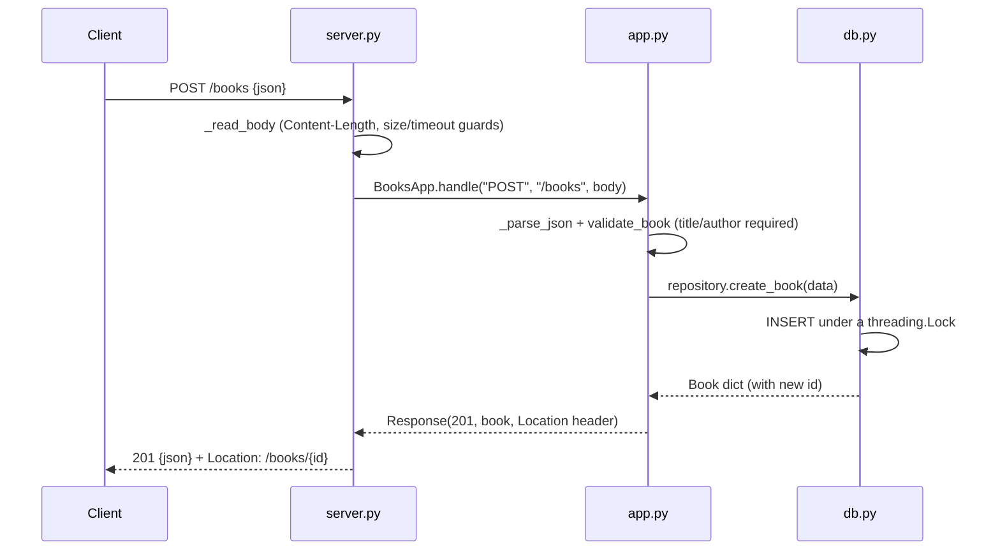

# Flow

The `POST /books` happy path is representative of the whole service. The `http.server`
transport (`server.py`) frames the request — rejecting chunked bodies, bad/oversized
`Content-Length`, and read timeouts — then delegates to the transport-independent
`BooksApp.handle`, which parses JSON (rejecting `NaN`/`Infinity`), validates via
`validate_book` (collecting every field error, not just the first), and calls
`BookRepository`. The repository serialises all access to a single shared SQLite
connection with a `threading.Lock`, so the threaded server is safe and an in-memory DB
survives across requests. Notable deviations from the minimal pattern: a clean
transport/app/repository/validation split; JSON error bodies replace the stdlib HTML
error pages; OPTIONS/HEAD/405-with-Allow are handled; case-insensitive (Unicode-aware)
author filtering via a custom `casefold` SQL function; and `AUTOINCREMENT` so deleted ids
are never reused.
