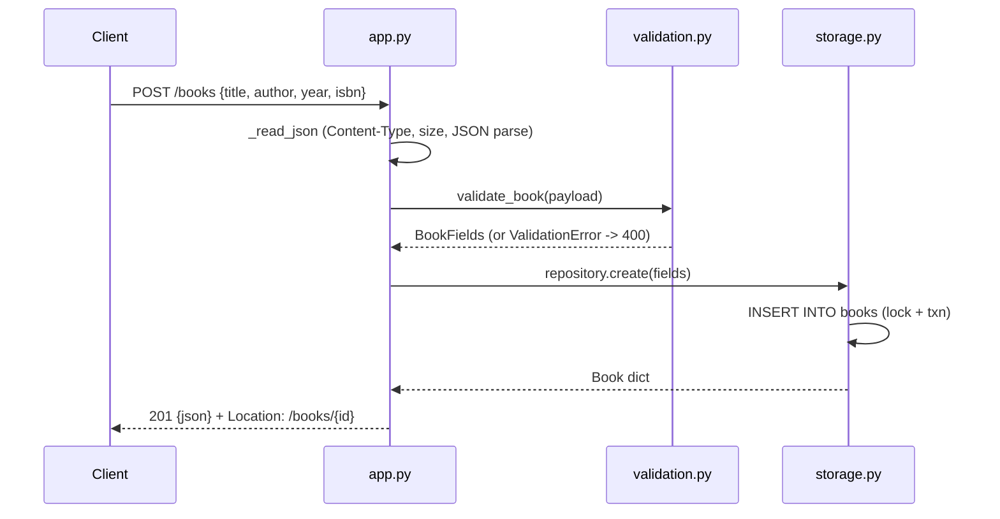

# Flow

A `POST /books` request is dispatched by a regex route table in `BookAPI._dispatch`. The body is read and content-type/size checked by `_read_json`, then validated by `validate_book` (title/author required non-blank strings; year an in-range int; isbn a well-formed ISBN-10/13; unknown fields rejected). The validated fields are inserted through `BookRepository.create`, which holds a threading lock around a single shared SQLite connection and returns the persisted row. The handler responds `201` with the JSON book and a `Location` header. Errors are centralised: `ValidationError` → 400 with per-field details, `HTTPError` → its status, any other exception → logged 500. Notable: no async, no external framework (pure stdlib `wsgiref`/`sqlite3`); a threaded WSGI server with one lock-guarded connection; Unicode-aware case-folded author filtering via a registered SQLite function.
