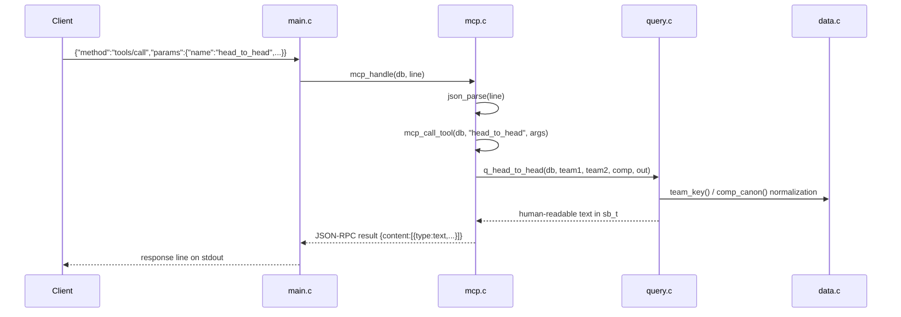

# Flow

At startup `main.c` calls `data.c:db_load()` once, which reads all six CSVs into arrays and de-duplicates overlapping match records. Each stdin line is parsed by the hand-written JSON parser in `mcp.c`; `tools/call` dispatches by name to a `q_*` function in `query.c`, which filters/aggregates the in-memory arrays (normalizing team names and competitions via `data.c`) and writes formatted text into a growable `sb_t` buffer. The text is JSON-escaped back into a JSON-RPC `result`. Notable: dependency-free C11 (libc only); no persistence or network; team-name normalization (accent folding, state-suffix disambiguation for ambiguous names like Atlético/América/Botafogo) is the main source of complexity.
