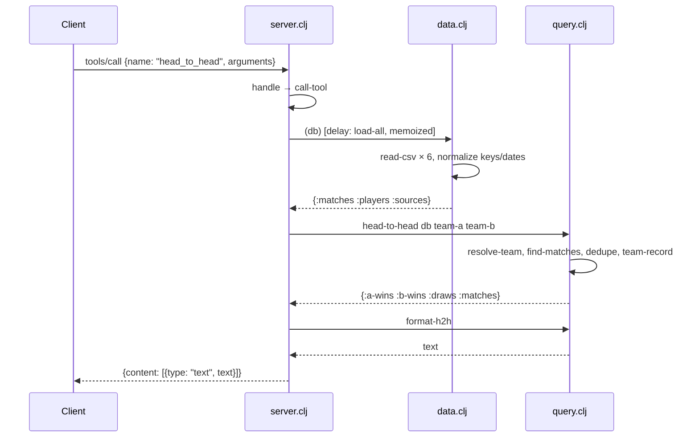

# Flow

A `tools/call` request is parsed line-by-line from stdin, routed through `handle` → `call-tool`, which looks the tool up in `tools-by-name` and invokes its handler with the shared, memoized db. The db is a `defonce`+`delay` loaded once (and warmed in a `future` at startup) by reading all six CSVs, canonicalizing team names via `team-key` (accent-stripping, state-suffix disambiguation, alias table) and normalizing dates to ISO. Query functions filter/aggregate the in-memory vectors; `dedupe-matches` collapses the same fixture appearing across files within a 3-day window. Results are formatted to human-readable text and wrapped in the MCP `content` envelope. Errors are caught: protocol/argument errors return JSON-RPC error codes, tool-internal errors return `isError: true` text rather than crashing the loop.
