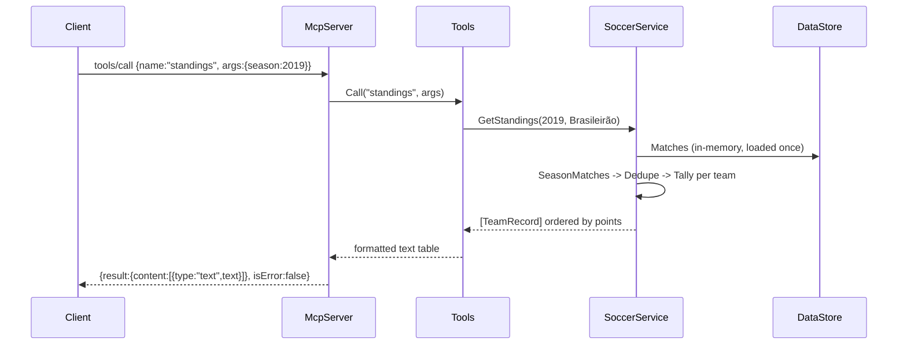

# Flow

A `tools/call` request is parsed by `McpServer.Handle`, dispatched to `Tools.Call`, which
routes to the named handler. For `standings`, `SoccerService.GetStandings` selects a single
source file per competition-season (the one with the most rows) to avoid double-counting
across overlapping datasets, deduplicates by (date, home, away), tallies W/D/L and goals per
normalized team key, and orders by points → wins → goal difference → goals for. The handler
renders the table as text (champion / relegation tags) and the server wraps it in an MCP
`content` result.

Notable characteristics:
- Data is loaded once at startup into memory; all queries are LINQ over lists (no DB, no external API).
- Team names are normalized (accent-stripping, state-suffix handling, alias regexes) so the same club matches across datasets.
- Overlapping match files are deduplicated; standings deliberately pick one source file per season to keep points correct.
- Multiple date formats and UTF-8/BOM CSVs are handled by a hand-rolled CSV parser and `Parse.Date`.
- The MCP server is hand-rolled JSON-RPC rather than an official MCP SDK.
