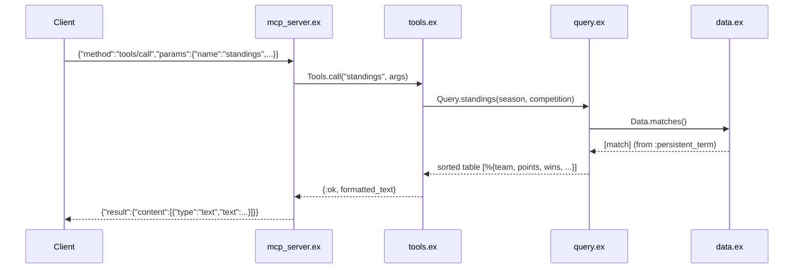

# Flow

On startup `MCPServer.main/0` calls `Data.load/0`, which parses all six CSVs once into
`:persistent_term` for lock-free reads. Each `tools/call` request is decoded, dispatched
by tool name through `Tools.call/2` (which whitelists arg names via
`String.to_existing_atom` to avoid atom leaks), computed against the in-memory match/player
lists in `Query`, formatted to a human-readable text block, and returned as MCP text
content. Standings/records/summaries are computed from raw match results, not hardcoded.

Notable: pure in-memory model (no DB, zero external deps); input validation at the tool
boundary (unknown competition → JSON-RPC-friendly `{:error, msg}`, rescue wrapper around
each tool call); team-name normalization is the load-bearing correctness layer that lets
name variants across five differently-formatted CSVs resolve to one key.
