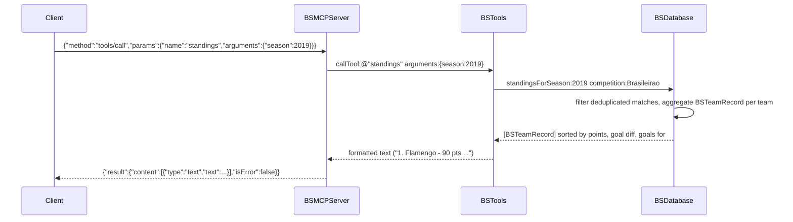

# Flow

At process start, `BSDatabase -initWithDataDirectory:` loads all six CSVs via `BSCSV`, normalizes team names (`BSTeamNames`) and dates, and de-duplicates matches that overlap across files (17,131 unique matches, 18,207 players loaded in ~1.1s). A `tools/call` request is parsed by `BSMCPServer:handleLine:`, dispatched to the matching `tool_<name>:` selector in `BSTools`, which queries the in-memory `BSDatabase` and formats a human-readable text block. Standings are computed on demand from match results (points = wins*3 + draws), not stored. Required-argument validation happens in `callTool:` before dispatch; unknown tools and missing args return `isError:true` rather than JSON-RPC errors. No network access, no external APIs, no persistence — everything is served from the in-memory dataset.
