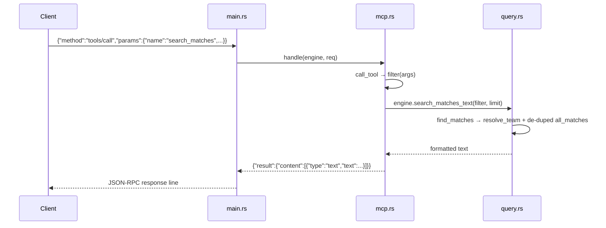

# Flow

On startup `main.rs` calls `Engine::load(dir)`, which invokes `Dataset::load` to read all six CSVs (normalizing team names via `team_key`/`fold` and dates via `normalize_date`) and then `Engine::new`, which de-duplicates overlapping fixtures across files (keeping, per `(competition, season)`, the source with the most matches). Each stdin line is parsed as a JSON-RPC request and routed by `mcp::handle`: `tools/call` builds a `MatchFilter` from the arguments, dispatches to the matching `Engine` method, and wraps the returned text in an MCP `content` block. Notifications (requests without an `id`) return `None` and emit nothing; malformed JSON yields a `-32700` parse error; unknown methods yield `-32601`. Errors from the query layer (e.g. unknown team) are returned as `isError` tool results rather than transport errors.
