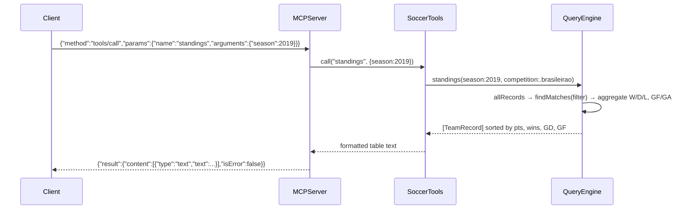

# Flow

A `tools/call` for `standings` is parsed by `MCPServer.handle`, dispatched by `SoccerTools.call` to `QueryEngine.standings`, which filters the loaded matches for that season/competition, aggregates each team's win/draw/loss and goals via `allRecords`, sorts by points → wins → goal difference → goals-for, and the tool formats the table (marking champion and, for 20-team Brasileirão, the relegation zone) before the server wraps it in a JSON-RPC result.

Notable characteristics (factual, not judgments): standings, records, and stats are all **computed from match rows** rather than hardcoded; data is loaded once at startup from CSVs on disk (no external API calls); team-name matching is normalized/aliased so accented and suffixed spellings unify; overlapping Brasileirão datasets are de-duplicated to one source per season; tool errors are returned as `isError:true` content rather than JSON-RPC errors; the server is a single-threaded synchronous stdio read loop.
