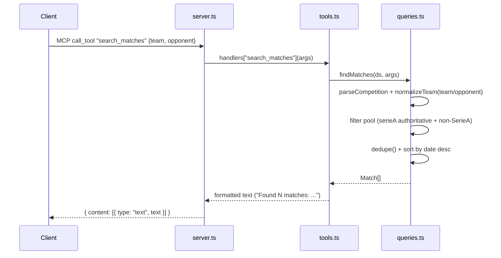

# Flow

At startup `buildServer()` calls `loadDataset()` once, parsing all six CSVs into an in-memory `Dataset` (matches + players + a per-season authoritative Série A index). Each MCP tool call is dispatched through the `handlers` map to a pure query function in `queries.ts`, whose plain-text result is wrapped in an MCP text content block. Team names are normalized (accent-stripped, state-suffix-aware) before matching, and overlapping source files are de-duplicated so cross-file fixtures are not double-counted. Errors are caught per-call in `server.ts` and returned as `isError` text rather than crashing the transport.

Notable: no async I/O in the hot path (data is loaded synchronously at boot, queries are pure in-memory array operations, so the spec's <2s / <5s latency targets are trivially met); competition strings are parsed leniently but an unknown competition throws, which is surfaced to the client as an error message.
