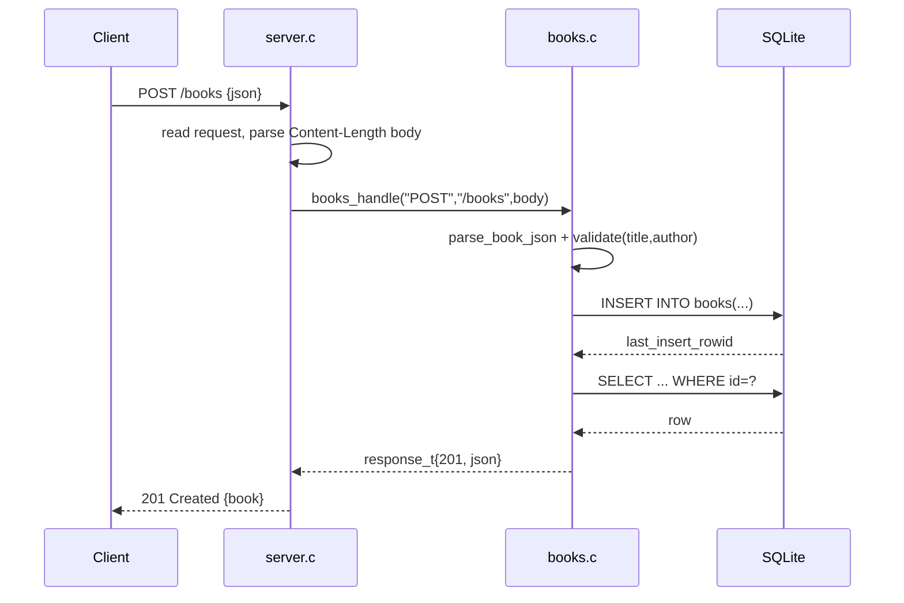

# Flow

A `POST /books` is read by `server.c:handle_client`, which reads until the full
Content-Length body has arrived, then dispatches to `books.c:books_handle`. The
router parses the flat JSON body, validates that `title` and `author` are present
non-blank strings (400 otherwise), inserts the row, then re-reads it by
`last_insert_rowid()` and returns it as `201`. Persistence is real SQLite (default
`books.db`, `:memory:` in tests). The server is single-threaded, one request per
connection (`Connection: close`), with no pagination on list. Input validation,
JSON string escaping, and `%`/`+` URL-decoding of the `?author=` filter are all
present.
