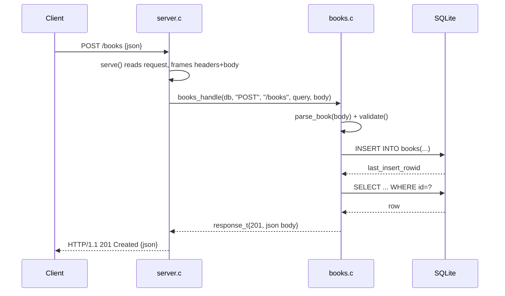

# Flow

A request to `POST /books` is read by `server.c:serve()`, which frames the HTTP
headers and body (enforcing a 1 MiB request cap and Content-Length). It calls
`books_handle`, which parses the flat-JSON body with a hand-written parser,
validates that `title` and `author` are non-empty strings (rejecting wrong types
and out-of-range `year`), inserts into SQLite via a prepared statement, then
re-selects the created row to return it as JSON with status 201. The server is a
single-threaded, sequential accept loop (one connection at a time); it has no
concurrency, no keep-alive (Connection: close), and no auth. JSON output escapes
control chars and encodes `\uXXXX`; the parser handles strings, integers, null,
and bool but not nested objects/arrays.
