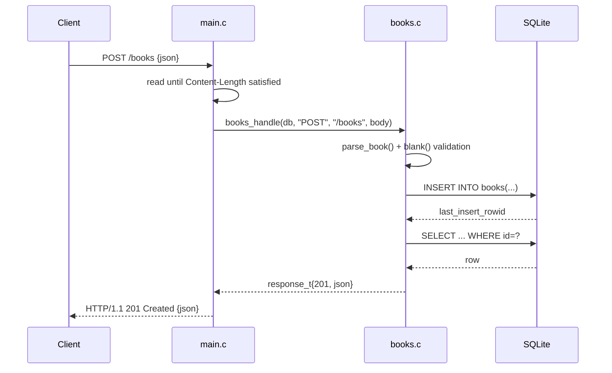

# Flow

`main.c:handle_conn` reads the whole request into a 1 MiB buffer, parses `Content-Length` to know when the body is complete, then calls the transport-independent `books.c:books_handle`. For POST it parses the flat JSON object with a hand-written parser, rejects blank `title`/`author` with 400, inserts via a prepared statement, and re-selects the new row to build the 201 response. The clean split between `main.c` (sockets) and `books.c` (logic) lets the tests drive `books_handle` directly against `:memory:` with no network. Notable: single-threaded blocking server, one connection at a time, `Connection: close` per request; the JSON parser is flat-only (rejects nested values) and silently ignores unknown keys.
