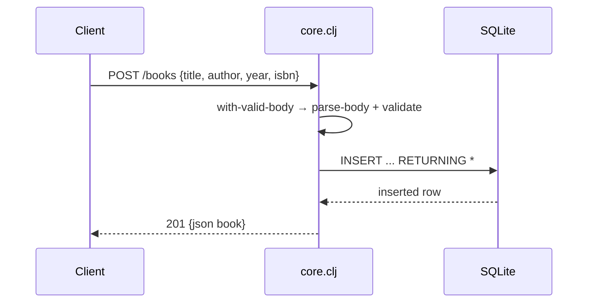

# Flow

A `POST /books` request is routed through Compojure to the handler, which calls `with-valid-body`: it slurps and JSON-parses the request body, runs `validate` (title and author required; year must be integer, isbn a string), and on success executes a parameterized `INSERT ... RETURNING *` via next.jdbc against SQLite, returning the persisted row as JSON with status 201. Validation failures short-circuit to 400 with an `{errors}` list, and a malformed/non-map body yields 400 `{errors: ["invalid JSON body"]}`. Row maps are built as unqualified lower-case keys (`rs/as-unqualified-lower-maps`). No pagination; author filtering is exact-match SQL.
