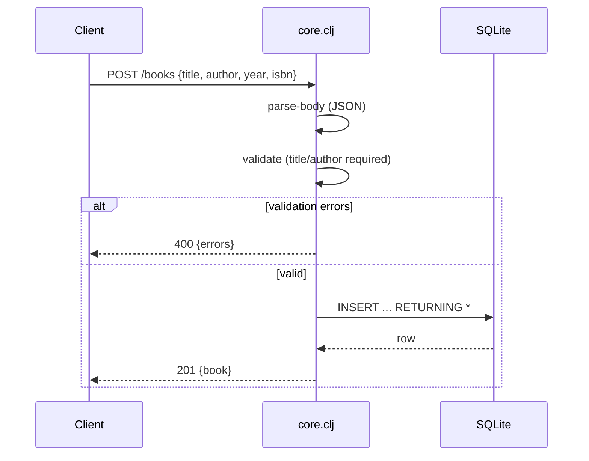

# Flow

A `POST /books` request is slurped and JSON-parsed by `parse-body`; malformed
JSON short-circuits to `400 {error: "invalid JSON"}`. `validate` then checks
that `title` and `author` are non-blank strings and that `year`/`isbn` (if
present) have correct types, returning `400 {errors: [...]}` on any failure.
On success the handler runs an `INSERT ... RETURNING *` via next.jdbc against
the embedded SQLite datasource and returns the persisted row as `201` JSON.
Input validation and error handling are present; the author filter is applied
both via Ring's parsed `:query-params` and a manual URL-decoding fallback on
the raw query string.
