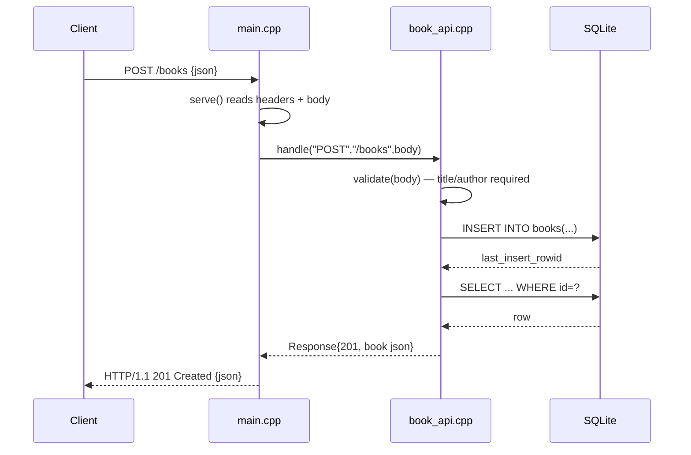

# Flow

A `POST /books` request is read by `serve()`, which parses the request line and `Content-Length`, then hands `method/target/body` to `BookApi::handle`. Routing dispatches to `create()`, which validates the body with a hand-rolled JSON parser (title and author must be non-empty strings; year, if present, must be an integer), inserts via a prepared statement, then re-selects the new row to build the JSON response with status upgraded to 201. Parameterized SQL is used throughout, so no injection. The server is single-threaded, blocking, one connection at a time with `Connection: close`; there is no persistent connection reuse or concurrency.
