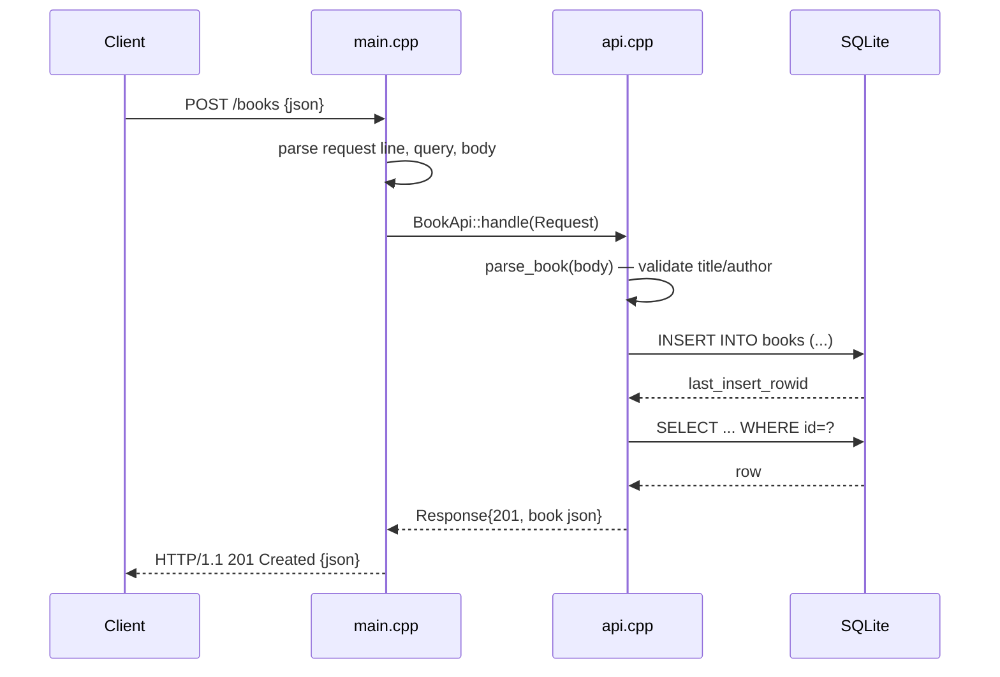

# Flow

`main.cpp:serve` reads the request until the header terminator, parses the request line, decodes the query string, and reads the body up to `Content-Length` (rejecting bodies over 1 MiB with 413). It builds a `Request` and calls `BookApi::handle`, which routes on path/method. `create` validates via `parse_book` (hand-written JSON parser; title and author must be non-empty strings) then INSERTs and re-SELECTs the row to return it as 201. The server is single-threaded, `Connection: close` per request, and all handler exceptions are caught and returned as 500. Notable: JSON parsing and serialization are hand-written (no third-party JSON library); persistence is real SQLite (`:memory:` in tests, file-backed at runtime).
