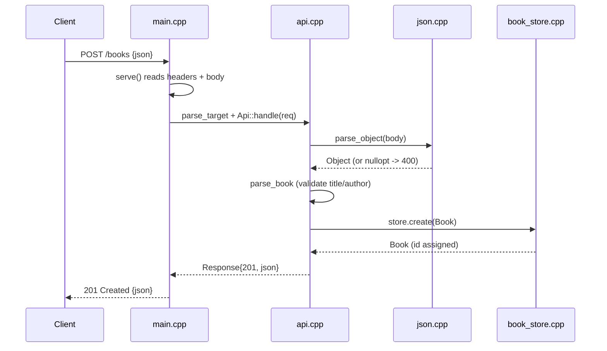

# Flow

A `POST /books` is read by the blocking `serve()` loop in `main.cpp` (one request per connection, `Connection: close`), which splits the request line, honors `Content-Length` (capped at 1 MiB → 413), then hands a transport-independent `Request` to `Api::handle`. The handler parses the body with the built-in flat-object JSON parser, validates that `title` and `author` are present non-blank strings (else `400 {error}`), inserts via a prepared SQLite statement, and returns the persisted book with its `AUTOINCREMENT` id as `201`. Input validation, error handling (try/catch → `500`), and exact-match `?author=` filtering are all present. The server is single-threaded and processes connections sequentially; there is no pagination.
