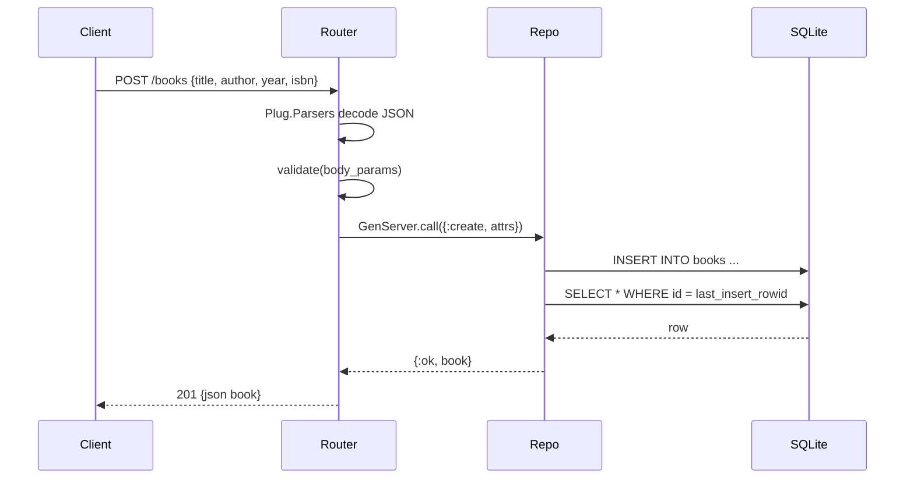

# Flow

A `POST /books` request is JSON-decoded by `Plug.Parsers`, then `Router.validate/1` checks that `title` and `author` are non-blank strings and that `year`/`isbn` are the right types. On success the router calls `Books.Repo` (a GenServer serializing all DB access), which runs an `INSERT` against SQLite via `exqlite` and re-`SELECT`s the inserted row to return it with its generated `id`, yielding `201`. Validation failures short-circuit to `422 {errors}`. All persistence is serialized through the single `Books.Repo` GenServer, so writes are naturally ordered; reads and writes share that one process. Error handling is present for validation (422), missing records (404), and non-integer ids (404 via `parse_id`).
