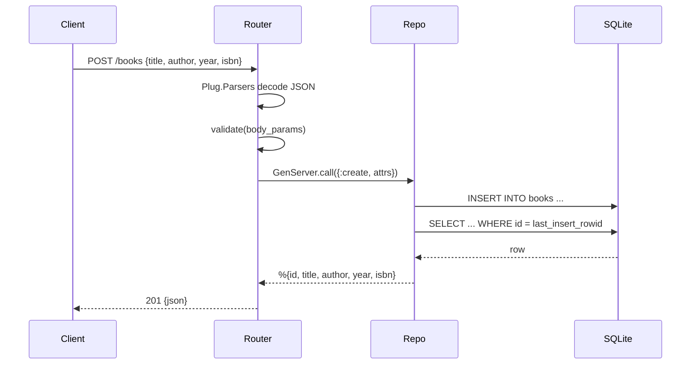

# Flow

A `POST /books` request is JSON-decoded by `Plug.Parsers`, then `validate/1` checks that `title` and `author` are non-blank strings and that `year`/`isbn` (if present) have the right types. On success the router calls `Books.Repo`, a GenServer that serializes all access to a single SQLite connection: it inserts the row, reads it back by `last_insert_rowid`, and returns the persisted map, which the router encodes as `201`. Validation failures short-circuit to `422 {errors: [...]}`. All persistence is synchronous through one GenServer, so writes are serialized (no connection pool).
