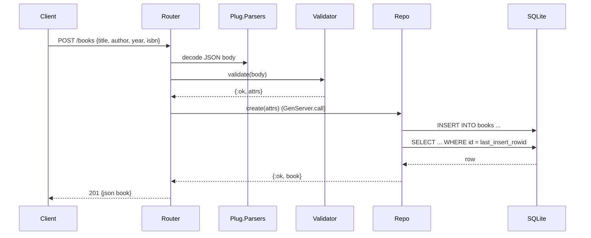

# Flow

A `POST /books` request has its JSON body parsed by `Plug.Parsers`, then `Books.Validator.validate/1` checks that `title` and `author` are present non-empty strings (and that `year`/`isbn` have the right types). On success the request is dispatched to `Books.Repo` — a GenServer serialising a single exqlite connection — which inserts the row and re-selects it by `last_insert_rowid` to return the persisted book, encoded as JSON with status 201. Validation failures return 422 with a per-field error map; a non-object or malformed body returns 422/400 respectively. All DB access is synchronous and serialised through one GenServer, so there is no connection pooling or concurrency within the store.
